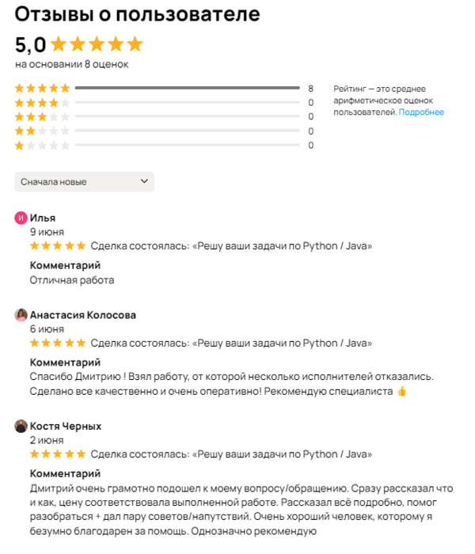
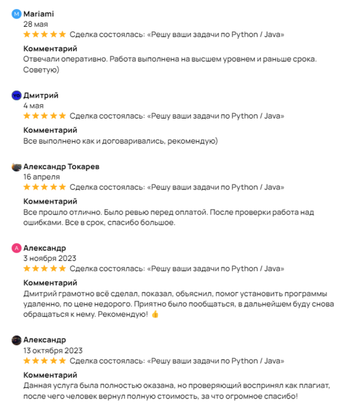

<h1 align="left">👨🏻‍💻Обо мне:</h1>
<h3 align="left">Дмитрий, 27 лет УрГПУ Информационные системы и технологии (09.03.02) 
<a href="https://www.avito.ru/moskva/predlozheniya_uslug/reshu_vashi_zadachi_po_python_3096219926">Занимаюсь коммерческой проектной деятельностью</a>
</h3>

  
  

## 🌐 Связь со мной:
 
 

# 💻 Технический стек:
 
            
 
  <!-- ... -->
    

### ✍️ Случайная цитата разработчика:

